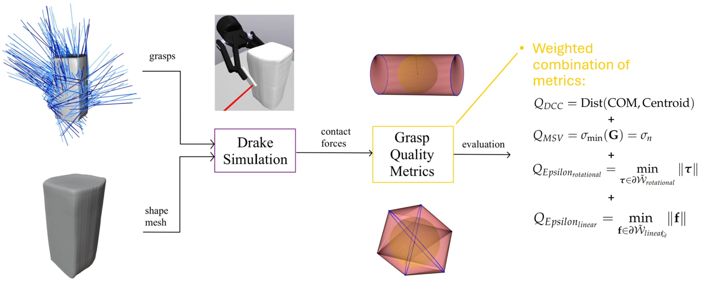
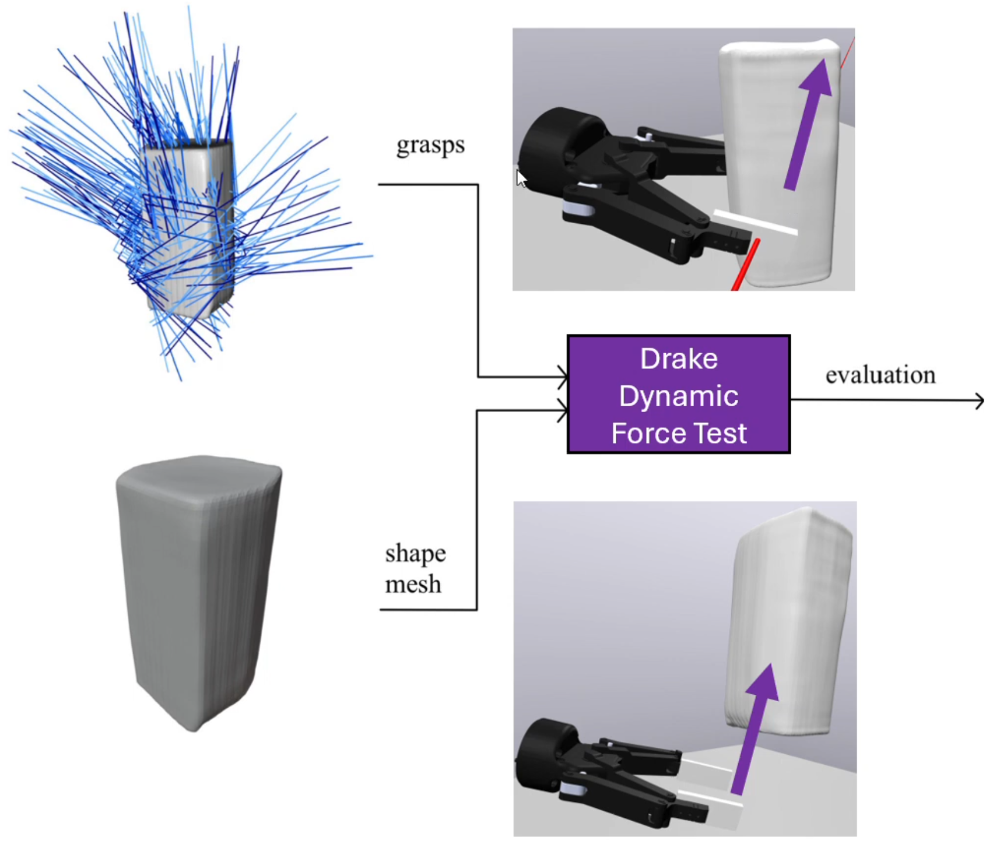
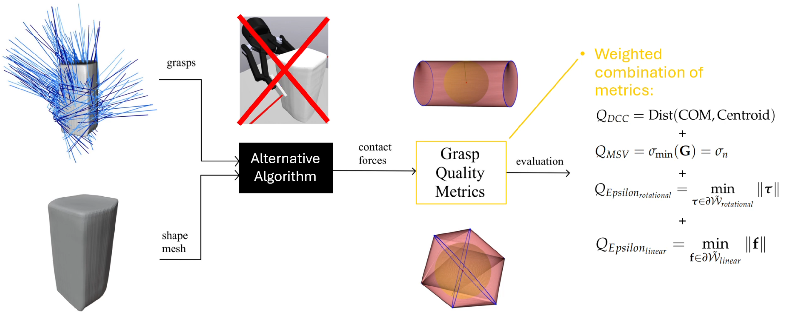
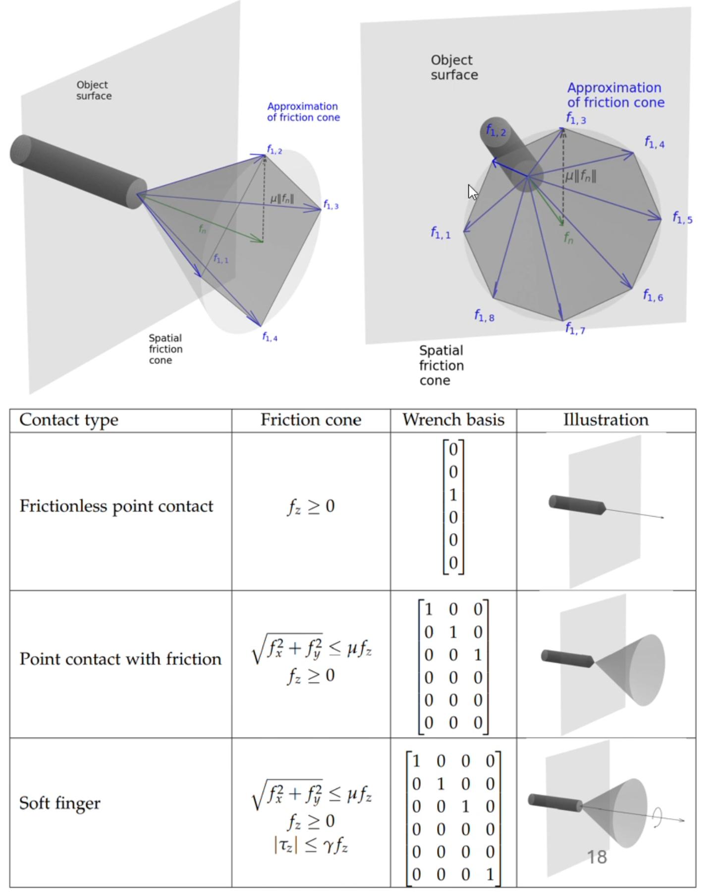
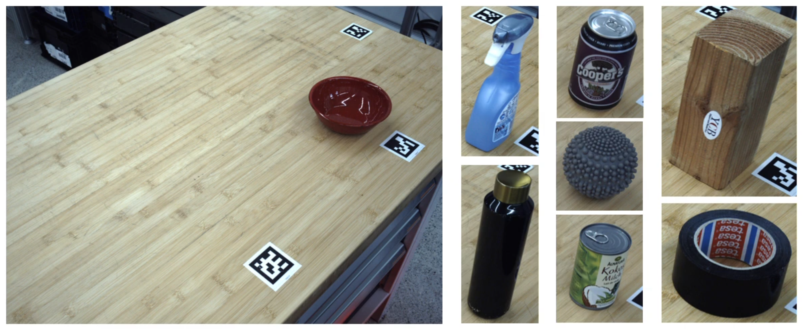
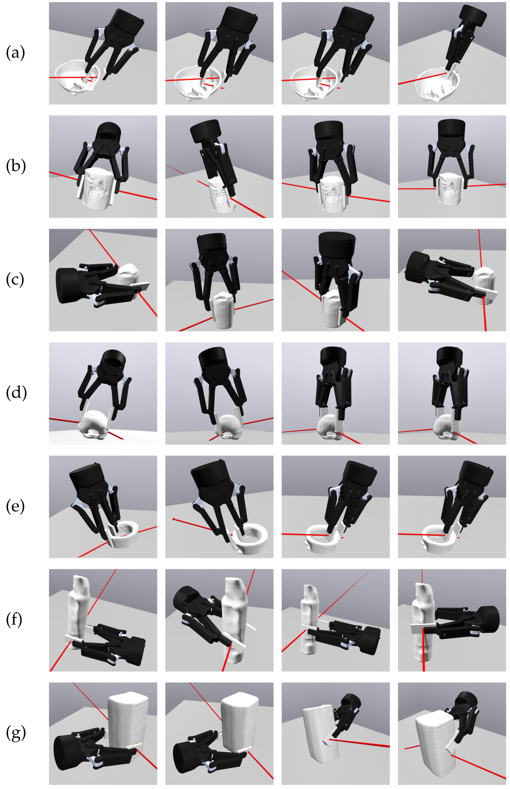

# Physics Simulation Based Grasp Evaluation

> Top-level entry point for Daniel He's master-thesis implementation. The original
> in-tree copy remains at
> `examples/simple_gripper/README_MasterThesisGraspSimulationAndEvaluation.md`.

**TL;DR: Video presentation of the Master Thesis:** https://www.youtube.com/watch?v=LdrG_YuUSac

### Motivation and Purpose

DLR's (German Aerospace Center) AIMM (Autonomous Industrial Mobile Manipulator) robot uses a parallel jaw gripper (Robotiq 2f-140) to pick up objects.

<p align="center">
  
</p>


Contact-GraspNet is a neural network that predicts grasps for a partial-view point cloud of an unknown object. The problem is: how do we know which of the many grasps predicted by the neural network are good and which are not? As seen in the image below, the best grasp natively ranked by Contact-GraspNet is not a good grasp. It is a decentralized grasp (green), while it is easy to see that a central grasp (blue) would be better.

<p align="center">
  
</p>

It is easy for us humans to see that the central grasp is a better grasp due to our physical intuition. My idea was to infuse that physical intuition into the grasp evaluation and selection process by using MIT's Drake simulation engine to simulate the grasps and evaluate their quality using four metrics. Below is the pipeline I came up with:


The pipeline starts from a partial-view point cloud captured by the robot's 3-camera system (RGB-D). INSTR segments individual objects. Contact-GraspNet then generates 6-DoF grasp pose candidates from the segmented point cloud. Simultaneously, Shape Completion (Humt et al.) reconstructs the full 3D mesh of the unknown object from the partial observation (this is necessary because the physics simulation requires complete object geometry).

These two outputs — grasp poses and a complete object mesh — are the shared inputs to all three evaluation methods:

### Evaluation Methods

#### DrakeStatic

For each grasp candidate, the parallel-jaw gripper is placed at the predicted pose on the reconstructed object mesh, the gripper closes, and the Drake hydroelastic simulation runs to a fixed end time. The contact information at the end of the run (contact forces, contact points, object COM) is used to compute four grasp quality metrics: epsilon linear, epsilon rotational, grasp-matrix minimum singular value, and centroid-to-COM distance. These normalized metrics are combined with fixed weights into one final DrakeStatic score used to re-rank the grasp candidates.

<p align="center">
  
</p>

#### DrakeDynamic

A ground-truth evaluation method. The simulation setup is the same as DrakeStatic, but after the gripper closes on the object, an external force is applied along selected axes. The object's displacement after perturbation measures how well the grasp resists disturbance. This serves as the reference score against which the other methods are compared.

<p align="center">
  
</p>

#### AltCGNOnlyStatic

A no-simulation baseline. Instead of running Drake, contact forces are estimated geometrically by ray-casting from the gripper finger pads onto the object mesh and using the surface normals at intersection points as approximate contact force directions. The same four grasp quality metrics are then applied in the grasp-quality evaluation step. This tests whether the computationally costly physics simulation actually adds value over a computationally cheap pure-geometry evaluation method.

<p align="center">
  
</p>

### Grasp Quality Metrics


#### Contact and Friction Model (Soft Finger)

The four metrics are computed from contact forces and contact points produced by Drake.
Following Section 3.2.1 of the thesis, each grasp is represented with:

- an object frame centered at the object's COM,
- one local contact frame per contact point,
- local contact-frame `z` axes aligned with the simulated normal force directions.

This work uses the **soft finger** contact model. In local contact frame `C_i`, admissible
contact wrench components satisfy:

- `||f_T|| <= mu * f_N`  (Coulomb friction constraint)
- `f_N >= 0`  (contact is compressive, no suction)
- `|tau_z| <= gamma * f_N`  (torsional friction limit)

where `f_T` is the tangential contact force, `f_N` is the normal contact force magnitude (= `f_z` in the contact frame, since the z-axis is aligned with the surface normal), `tau_z` is the torsional moment about the contact normal, `mu` is the friction coefficient, and `gamma` is the torsional friction coefficient.

For numerical evaluation, the friction cone is approximated with spanning vectors
(friction-cone discretization), and resulting force/moment sets are used to compute
the epsilon and grasp-quality metrics.

<p align="center">
  
</p>

Four metrics are used to evaluate grasp quality:

1. **Epsilon Metric (Linear)** -- The epsilon metric linear calculation is based on the grasp wrench hull analysis, which computes the convex hull of all forces and moments acting on the object's center of mass
2. **Epsilon Metric (Rotational)** -- The rotational epsilon metric examines the rotational grasp wrench hull spanned by torques acting on the object. This metric accounts for both the torques induced by the approximated friction cone spanning linear forces and the additional moments
3. **Distance Centroid to COM** -- The distance between the centroid of the two contact points and the object's COM quantifies how centered a grasp is relative to the object's COM. This metric works well for regular convex shapes but becomes inaccurate for objects like toroids, where stable grasps can occur despite larger centroid-COM distances.
4. **Grasp Matrix Minimum Singular Value** -- Minimum singular value of the grasp matrix G. Measures how far the grasp configuration is from singularity (losing wrench resistance in some direction).


### Repository Content

The main files are:
- [DrakeStatic.cc](examples/simple_gripper/DrakeStatic.cc) -- static grasp simulation at equilibrium
- [DrakeDynamic.cc](examples/simple_gripper/DrakeDynamic.cc) -- dynamic grasp simulation with external force application
- [AltCGNOnlyStatic.py](examples/simple_gripper/AltCGNOnlyStatic.py) -- no-simulation baseline using geometric ray-casting for contact estimation
- [drake_grasp_quality_metrics.py](examples/simple_gripper/drake_grasp_quality_metrics.py) -- grasp quality metrics computation (epsilon, singular value, centroid-COM distance)

and the object file folders in [uogp_2024](examples/simple_gripper/uogp_2024) (sidenote: 'uogp' stands for 
unknown objects grasp planner and was a project name used for my Master Thesis project):

<p align="center">
  
</p>

- [Bowl](examples/simple_gripper/uogp_2024%2FBowl)
- [CheezItBox](examples/simple_gripper/uogp_2024%2FCheezItBox)
- [CoconutMilkCan](examples/simple_gripper/uogp_2024%2FCoconutMilkCan)
- [Duck](examples/simple_gripper/uogp_2024%2FDuck)
- [SodaCan](examples/simple_gripper/uogp_2024%2FSodaCan)
- [Sprayer](examples/simple_gripper/uogp_2024%2FSprayer)
- [TapeLyingDown](examples/simple_gripper/uogp_2024%2FTapeLyingDown)
- [WaterBottle](examples/simple_gripper/uogp_2024%2FWaterBottle)
- [WoodBlock](examples/simple_gripper/uogp_2024%2FWoodBlock)
- [YogaBall](examples/simple_gripper/uogp_2024%2FYogaBall)

Each object folder has an object mesh file and simulation settings detailing
object properties like weight and hydroelastic modulus used for the
simulation.


**Note on object meshes:** The meshes are not ground truth CAD models. They were predicted by a [shape completion neural network](https://elib.dlr.de/195724/) from partial-view point clouds recorded with DLR's AIMM sensor system.


### Build and Run

Requires [Drake](https://drake.mit.edu/installation.html) (tested on Ubuntu 22.04).

Build both simulation targets:
```bash
bazel build //examples/simple_gripper:DrakeStatic //examples/simple_gripper:DrakeDynamic
```

Notes:
- `--orientation` is parsed as quaternion `w,x,y,z`.

Example run (static simulation, matches the screenshot below):
```bash
bazel run //examples/simple_gripper:DrakeStatic -- \
  --position=0.192292,0.079613,-0.016357 \
  --orientation=-0.514892,-0.518741,0.615273,0.295354 \
  --gripper_opening=0.048694 \
  --manual_correction=0.0 \
  --table_correction=-0.11498 \
  --NoHeightCorrection \
  --uogp_object=Sprayer \
  --advanceSimTo=0.7
```

This yields the following static grasp pose:
<p align="center">
  
</p>

Dynamic perturbation run (force application):
```bash
bazel run //examples/simple_gripper:DrakeDynamic -- \
  --position=0.192292,0.079613,-0.016357 \
  --orientation=-0.514892,-0.518741,0.615273,0.295354 \
  --gripper_opening=0.048694 \
  --manual_correction=0.0 \
  --table_correction=-0.11498 \
  --NoHeightCorrection \
  --uogp_object=Sprayer \
  --advanceSimTo=0.7 \
  --SelectForceDirection=y \
  --SelectMomentDirection=x \
  --force_start=0.55 \
  --force_end=0.56 \
  --force_magnitude=180.5
```

This yields the following force perturbation test result:
<p align="center">
  
</p>
<p align="center">
  
</p>

### Batch Evaluation Automation

To evaluate many grasp hypotheses automatically, use:

- `examples/simple_gripper/thesis_eval/run_drake_static_batch.py`
- `examples/simple_gripper/thesis_eval/run_drake_dynamic_batch.py`

Both scripts iterate grasp rows from a CSV and launch Drake once per grasp.
`AltCGNOnlyStatic.py` is different: it already batches in one Python run and does not launch Drake subprocesses per grasp.

From the Drake workspace root:
```bash
DATA_DIR=<DATA_DIR>/Sprayer
INPUT_CSV="$DATA_DIR/object_1_UOGPLog_heightCorrected.csv"
MESH_OBJ="$DATA_DIR/Sprayer.obj"

# Verified static IDs on this setup: 0,2
python examples/simple_gripper/thesis_eval/run_drake_static_batch.py \
  --input_csv "$INPUT_CSV" \
  --output_csv /tmp/sprayer_static_ids0_2.csv \
  --mesh_path "$MESH_OBJ" \
  --uogp_object Sprayer \
  --ids 0,2

# Verified dynamic IDs on this setup: 0,1
python examples/simple_gripper/thesis_eval/run_drake_dynamic_batch.py \
  --input_csv "$INPUT_CSV" \
  --output_csv /tmp/sprayer_dynamic_ids0_1.csv \
  --mesh_path "$MESH_OBJ" \
  --uogp_object Sprayer \
  --ids 0,1 \
  --force_magnitude 180.5 \
  --force_direction y \
  --moment_direction x
```

AltCGNOnlyStatic baseline (with visualization, random 15% sample):
```bash
ALT_DATA_DIR=<DATA_DIR>/WaterBottle
ALT_INPUT_CSV="$ALT_DATA_DIR/object_1_UOGPLog_heightCorrected.csv"
ALT_MESH_OBJ="$ALT_DATA_DIR/WaterBottle.obj"

python examples/simple_gripper/AltCGNOnlyStatic.py \
  --input_csv "$ALT_INPUT_CSV" \
  --mesh_path "$ALT_MESH_OBJ" \
  --VizPercentage 15 \
  --RandomSeed 42
```

Notes:
- Replace `<DATA_DIR>` with your object-data folder containing the CSV and OBJ mesh.
- Defaults assume binaries in `bazel-bin/examples/simple_gripper/`; use `--binary` to override.
- Batch scripts are intended for CSV generation, not interactive inspection: they auto-finish each Drake run.
- If you want to inspect the scene in MeshCat (`http://localhost:7000/`), run `DrakeStatic` or `DrakeDynamic` directly with a single grasp command from the **Build and Run** section.
- Add `--quiet` only if you want less subprocess log output.
- For headless AltCGNOnlyStatic runs (no Open3D window), add `--NoVisualization`.
- AltCGNOnlyStatic does not apply Drake's gripper height correction flags; it evaluates the grasp poses directly from the input CSV against the selected object mesh.

### Results

<p align="center">
  
</p>
<p>
Best-grasp comparison across evaluation methods. Each row shows one object,
and columns are ordered left to right as: ground truth (DrakeDynamic),
CGNNative, DrakeStatic, and AltCGNOnlyStatic. Objects shown are
(a) Bowl, (b) Coconut Milk Can, (c) Soda Can, (d) Soft Massage Ball,
(e) Tape, (f) Water Bottle, and (g) Wood Block.
</p>

<p align="center">
  
</p>

DrakeStatic (physics simulation based grasp evaluation) achieves a 9% higher average score than CGNNative (the baseline neural network ranking), evaluated against DrakeDynamic as ground truth.

### Limitations

Main limitations of this thesis setup (see Discussion / Conclusion in the thesis PDF):

- **Asymmetric filtering from edge-bleeding handling:** table-height and filtering corrections affected objects differently, which reduced comparability across objects.
- **Shape-completion artifacts:** some reconstructed meshes contained geometric artifacts (for example bowl and water bottle cases) that affected contact behavior in simulation.
- **Small effective dataset:** only a limited subset of recorded objects produced stable, usable meshes and comparable grasps.
- **Ground-truth method limitations (DrakeDynamic):** this ground-truth method is itself also simulation-based (not measured directly on the real robot). The force-test protocol can be direction-biased and uses final displacement as a proxy for stability, which can overestimate some grasps.
- **Comparison coupling:** for consistency, parts of the evaluation used additional filtering alignment between methods, which may exclude otherwise valid grasps.

### Master Thesis

For further details, please read the full master thesis: [Physics Simulation Based Grasp Evaluation (PDF)](https://drive.google.com/file/d/1C8ZW7rYitUK_JMPhP74w9mC_RICNlwHJ/view?usp=sharing)
