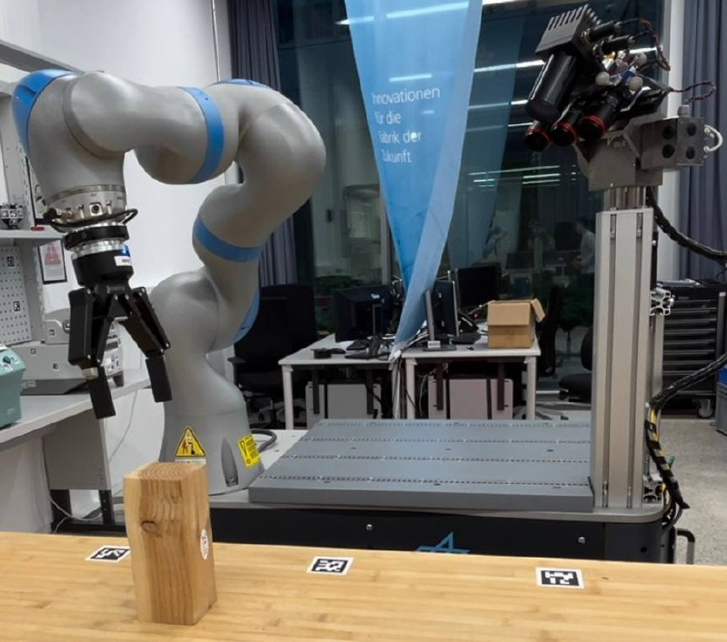
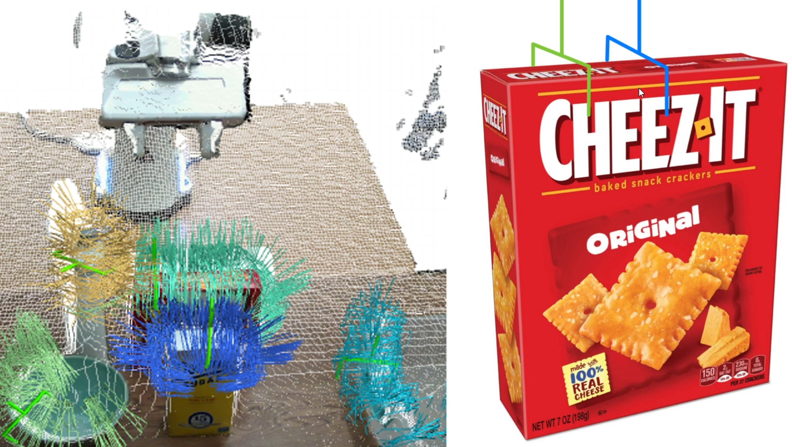
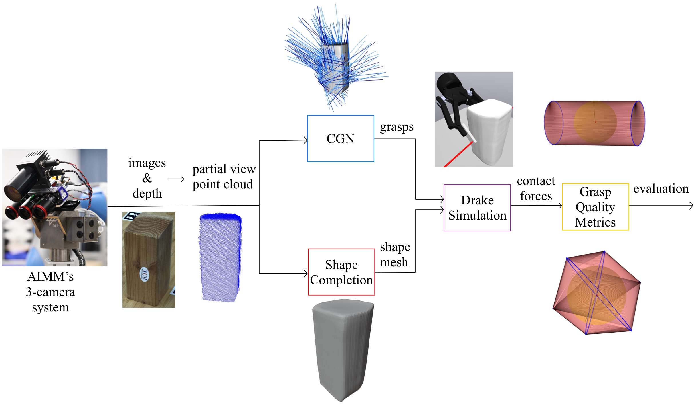
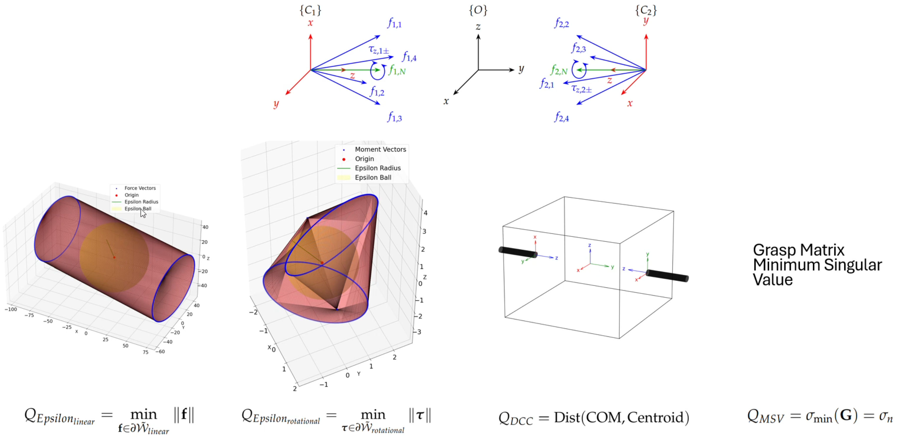
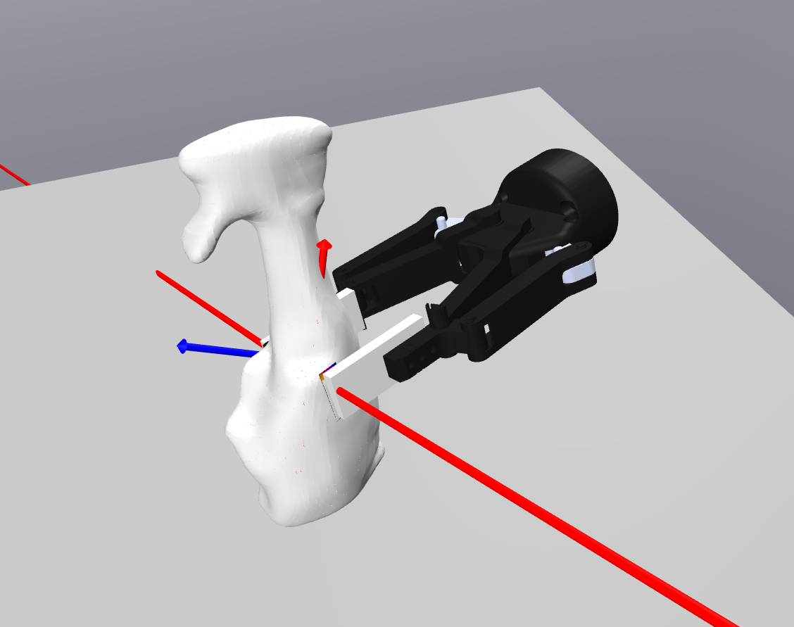
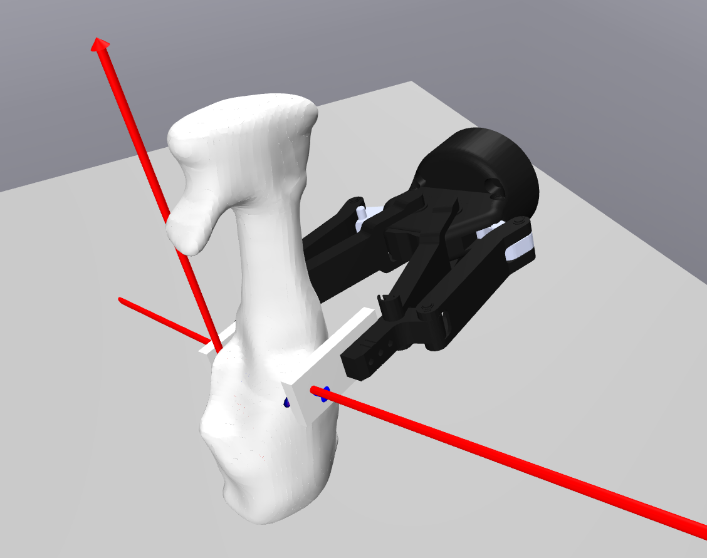
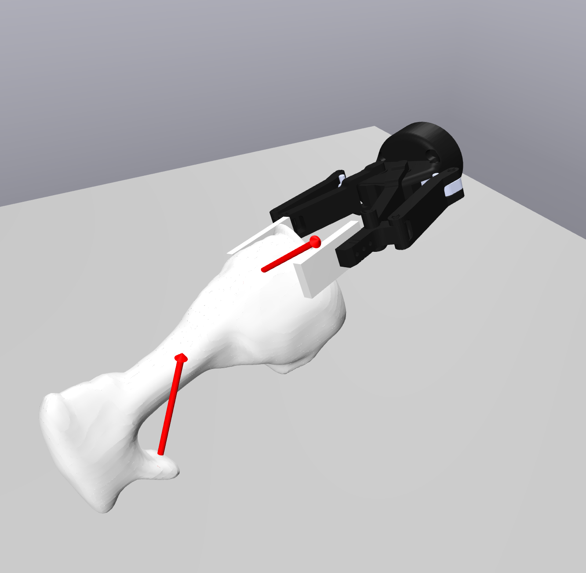
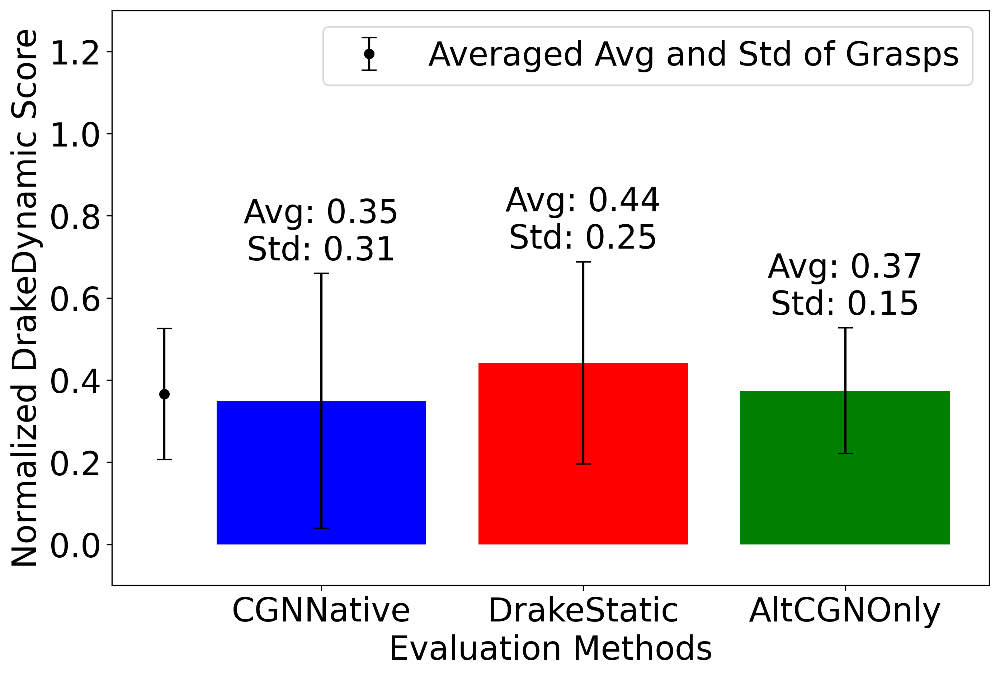

# Physics Simulation Based Grasp Evaluation

**TL;DR: Video presentation of the Master Thesis:** https://www.youtube.com/watch?v=LdrG_YuUSac

### Motivation and Purpose

DLR's (German Aerospace Center) AIMM (Autonomous Industrial Mobile Manipulator) robot uses a parallel jaw gripper (Robotiq 2f-140) to pick up objects.




Contact-GraspNet is a neural network that predicts grasps for partial view point cloud of an unknown object. The problem is: how do we know which of the many grasps predicted by the neural network are good and which are not? As seen in the image below, the best grasp natively ranked by Contact-GraspNet is not a good grasp. It is a decentral grasp (green), while it is easy to see that a central grasp (blue) would be better.



It is easy for us humans to see that the central grasp is a better grasp due to our physical intuition. My idea was to infuse that physical intuition into the grasp evaluation and selection process by using MIT's Drake simulation engine to simulate the grasps and evaluate their quality using four metrics. Below is the pipeline I came up with:



**Input:** Partial-view point cloud synthesized from the AIMM's 3-camera system (RGB-D).

The pipeline combines three neural networks with physics simulation:

1. **INSTR** segments the scene to isolate individual objects from the RGB-D input.
2. **Contact-GraspNet (CGN)** generates 6-DoF grasp pose candidates from the partial-view point cloud.
3. **Shape Completion** reconstructs a full 3D mesh from the partial point cloud, needed because the physics simulation requires a complete object geometry.
4. **Drake Simulation** (this repository) takes the grasp poses and the completed mesh, simulates each grasp with hydroelastic contact modeling, and outputs contact force vectors.
5. **Grasp Quality Metrics** (this repository) evaluates the simulated contact forces using the four metrics described below.

**Output:** A quality score for each grasp candidate, used to re-rank grasps before execution on the real robot.

### Grasp Quality Metrics



Four metrics are used to evaluate grasp quality:

1. **Epsilon Metric (Linear)** -- The epsilon metric linear calculation is based on the grasp wrench hull analysis, which computes the convex hull of all forces and moments acting on the object’s center of mass
2. **Epsilon Metric (Rotational)** -- The rotational epsilon metric examines the rotational grasp wrench hull spanned by torques acting on the object. This metric accounts for both the torques induced by the approximated friction cone spanning linear forces and the additional moments
3. **Distance Centroid to COM** -- The distance between the centroid of the two contact points and the object’s COM quantifies how centered a grasp is relative to the object’s COM. This metric works well for regular convex shapes but becomes inaccurate for objects like toroids, where stable grasps can occur despite larger centroid-COM distances.
4. **Grasp Matrix Minimum Singular Value** -- Minimum singular value of the grasp matrix G. Measures how far the grasp configuration is from singularity (losing wrench resistance in some direction).


### Repository Content

The main files are:
- [DrakeDynamic.cc](DrakeDynamic.cc) -- dynamic grasp simulation with external force/torque application
- [DrakeStatic.cc](DrakeStatic.cc) -- static grasp simulation at equilibrium
- [AltCGNOnlyStatic.py](AltCGNOnlyStatic.py) -- alternative evaluation method that estimates contact forces via geometric ray-casting (no Drake simulation), used as a comparison baseline
- [drake_grasp_quality_metrics.py](drake_grasp_quality_metrics.py) -- grasp quality metrics computation (epsilon, singular value, centroid-COM distance)

and the object file folders in [uogp_2024](uogp_2024) (sidenote: 'uogp' stands for 
unknown objects grasp planner and was a project name used for my Master Thesis project):
- [Bowl](uogp_2024%2FBowl)
- [CheezItBox](uogp_2024%2FCheezItBox)
- [CoconutMilkCan](uogp_2024%2FCoconutMilkCan)
- [Duck](uogp_2024%2FDuck)
- [SodaCan](uogp_2024%2FSodaCan)
- [Sprayer](uogp_2024%2FSprayer)
- [TapeLyingDown](uogp_2024%2FTapeLyingDown)
- [WaterBottle](uogp_2024%2FWaterBottle)
- [WoodBlock](uogp_2024%2FWoodBlock)
- [YogaBall](uogp_2024%2FYogaBall)


Each object folder has an object mesh file and simulation settings detailing
object properties like weight and hydroelastic modulus used for the
simulation.


**Note on object meshes:** The meshes are not ground truth CAD models. They were predicted by a [shape completion neural network](https://elib.dlr.de/195724/) from partial-view point clouds recorded with DLR's AIMM sensor system.


### Build and Run

Requires [Drake](https://drake.mit.edu/installation.html) (tested on Ubuntu 22.04).

Build both simulation targets:
```bash
bazel build //examples/simple_gripper:DrakeStatic //examples/simple_gripper:DrakeDynamic
```

Notes:
- `--orientation` is parsed as quaternion`x,y,z,w`.

Example run (static simulation, matches the screenshot below):
```bash
bazel run //examples/simple_gripper:DrakeStatic -- \
  --position=0.192292,0.079613,-0.016357 \
  --orientation=-0.514892,-0.518741,0.615273,0.295354 \
  --gripper_opening=0.048694 \
  --manual_correction=0.0 \
  --table_correction=-0.11498 \
  --NoHeightCorrection \
  --uogp_object=Sprayer \
  --advanceSimTo=0.7
```

This yields the following static grasp pose:
<p align="center">
  
</p>

Dynamic perturbation run (force / moment application):
```bash
bazel run //examples/simple_gripper:DrakeDynamic -- \
  --position=0.192292,0.079613,-0.016357 \
  --orientation=-0.514892,-0.518741,0.615273,0.295354 \
  --gripper_opening=0.048694 \
  --manual_correction=0.0 \
  --table_correction=-0.11498 \
  --NoHeightCorrection \
  --uogp_object=Sprayer \
  --advanceSimTo=0.7 \
  --SelectForceDirection=y \
  --SelectMomentDirection=x \
  --force_start=0.55 \
  --force_end=0.56 \
  --force_magnitude=180.5
```

This yields the following force pertubation test result:
<p align="center">
  
</p>
<p align="center">
  
</p>

DrakeDynamic is a force pertubation test used as the ground-truth evaluation in the results section.

### Results

<p align="center">
  
</p>

DrakeStatic (physics simulation based grasp evaluation) achieves a 9% higher average score than CGNNative (the baseline neural network ranking), evaluated against DrakeDynamic as ground truth.

